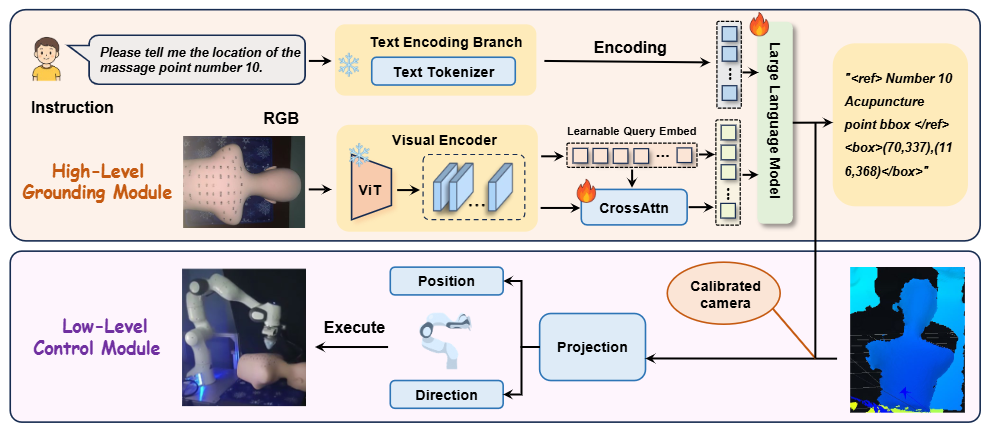
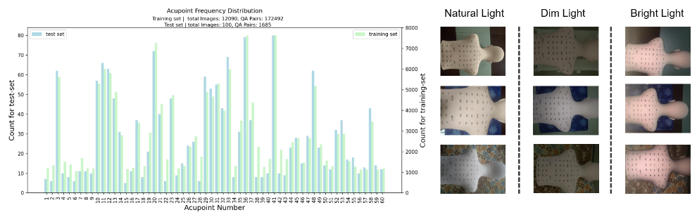

<div align="center">

# HMR-1: Hierarchical Massage Robot with Vision-Language-Model for Embodied Healthcare

[]()
[]()
[]()


</div>

# Introduction

This repository presents **HMR-1**, a hierarchical massage robot framework for embodied healthcare.  
HMR-1 integrates a **high-level acupoint grounding module** powered by vision-language models and a **low-level control module** for trajectory planning and robotic execution. To support this task, we construct **MedMassage-12K**, a multimodal dataset containing large-scale acupoint images and QA pairs under diverse lighting and background conditions.  
Our framework enables robots to understand natural language instructions, localize target acupoints, and perform precise massage actions in real-world environments.


---

# Dataset

**MedMassage-12K** is a multimodal dataset for embodied massage and acupoint grounding.  
It includes large-scale image-text samples collected under diverse lighting, background, and pose conditions, and is designed to support language-guided acupoint localization, multimodal reasoning, and robotic massage execution in real-world healthcare scenarios.



## Dataset Download


You can download the Dataset from Baidu Netdisk:

- **Link**: [https://pan.baidu.com/s/1-yge3B-41eaUIiQOyxs0FQ](https://pan.baidu.com/s/1-yge3B-41eaUIiQOyxs0FQ)
- **Extraction Code**: `PKGR`


```


